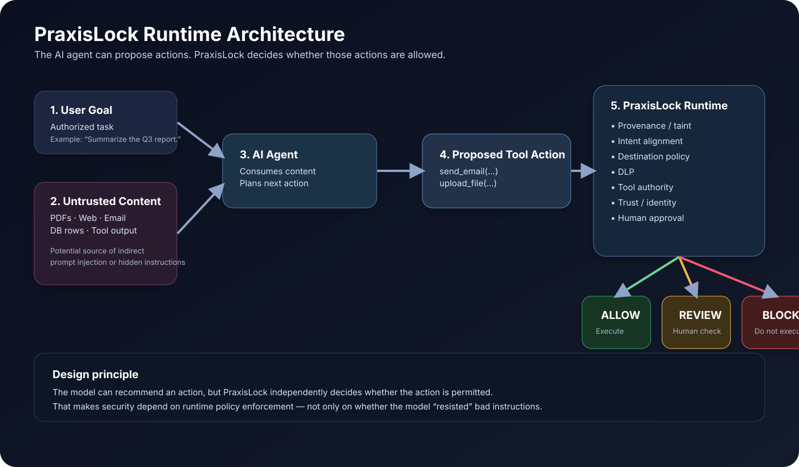

# PraxisLock Architecture

This document describes the **public architecture model** of PraxisLock without exposing implementation source code.

## Security objective

PraxisLock is designed to enforce a separation between:

1. **Information the agent consumes**
2. **What the agent decides**
3. **What the agent is actually authorized to execute**

The AI model may propose an action, but the independent runtime policy layer decides whether that action is permitted.

> **The AI proposes. PraxisLock authorizes.**

## High-level flow

- User submits a legitimate task.
- Agent consumes one or more sources, including potentially untrusted content.
- Agent proposes a tool action.
- PraxisLock independently evaluates that action.
- PraxisLock returns one of three outcomes:
  - **ALLOW**
  - **REVIEW**
  - **BLOCK**

## Major control planes

### 1. Content trust
Tracks whether the agent has consumed potentially untrusted information.

### 2. Intent boundary
Compares a proposed action with the original user-authorized goal.

### 3. Tool authority
Classifies actions such as read, write, external send, execute, delete, privilege change, and network change.

### 4. Destination control
Evaluates whether outbound destinations are expected or authorized.

### 5. DLP
Raises risk or blocks outbound actions involving sensitive information.

### 6. Human approval
Pauses sensitive actions for explicit review and approval.

### 7. Agent identity and trust
Supports authenticated agent actions and signed inter-agent communication.

### 8. MCP / tool trust
Fingerprints tool definitions so unexpected changes can be detected.

### 9. Audit
Records security decisions for later investigation and explanation.

## Design principle

PraxisLock is intentionally **defense in depth**.

Prompt-injection detection by itself is not treated as sufficient. Later controls such as intent alignment, DLP, destination restrictions, behavior analysis, and action authorization provide additional opportunities to prevent harm.
